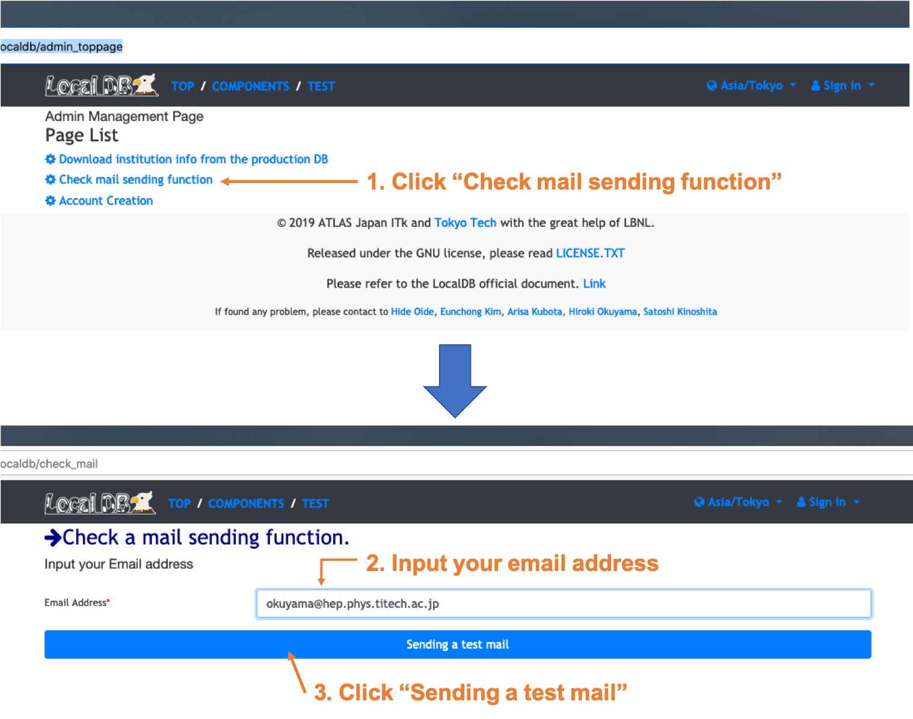

# Check Mail Sending Function
Admin can create users in LocalDB. The users can upload QC test results in LocalDB and use user functions in LocalDB viewer.(e.g. Download module ID from the production DB, Comments, Sign off QC results...).<br>

We can use mail sending function to send a temporary password and massages from admin when we register a user in LocalDB.<br>
We need to check if it can be used in your network environment.<br>

## Check the mail function
Please go to the admin page and follow the instruction below.<br>
<br>
If you get a test mail from LocalDB, you can use the function in the environment and please go to the next setting.<br>

### If you failed to send mail or couldn't get a mail from LocalDB
You need to change the config for LocalDB viewer not to use the mail function.<br>
(i) Kill the process of LocalDB viewer.<br>
(ii) edit admin.conf in localdb-tools/viewer like below.<br>

```yml
# Set configs for web viewer
...
flask:
...
  mail:False
```

(iii) Re-launch the LocalDB viewer and go to the next setting.<br>


<br>
[&rarr; Back to the page](setup_database.md)
