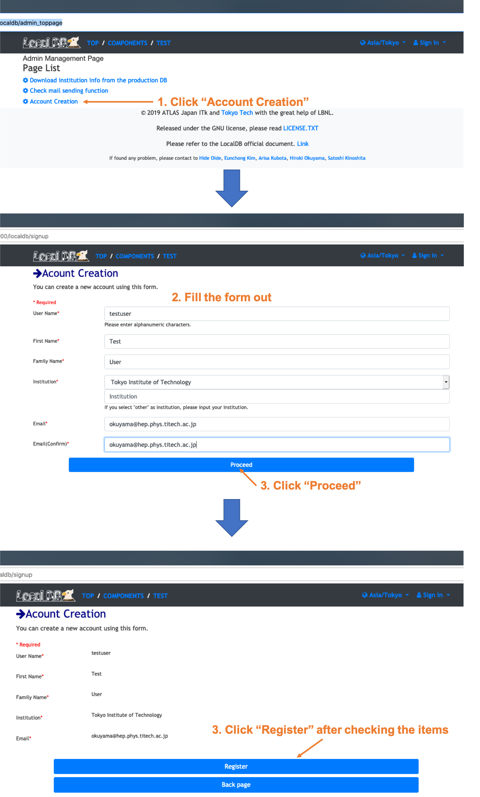
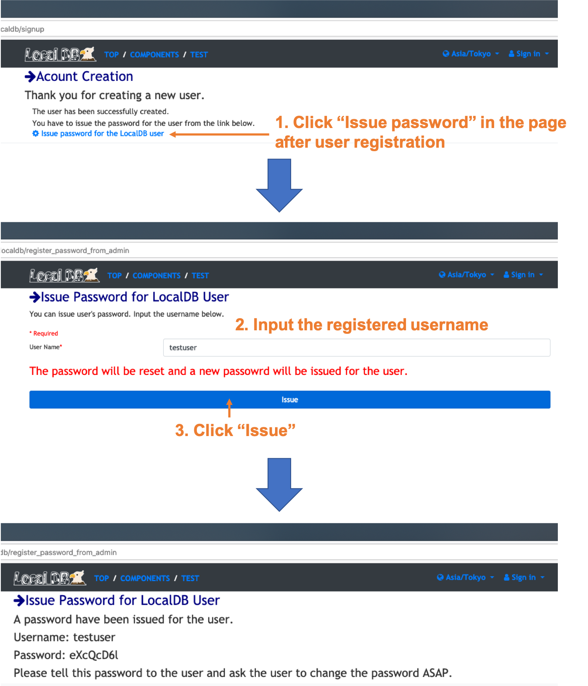
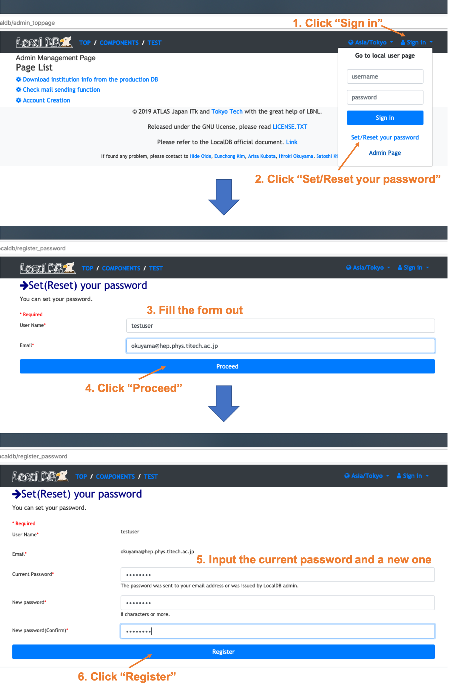

# Create LocalDB user
Admin can create users in LocalDB. The users can upload QC test results in LocalDB and use user functions in LocalDB viewer.(e.g. Download module ID from the production DB, Comments, Sign off QC results...). 

Please go to the admin page and follow the instruction below. 
 

##For admin using mail sending function
After the registration, an email will be sent for the registered address and user can finish registering password process. 

##For admin not using mail sending function
Admin need to issue a password for the registered user. 
Please follow the instruction below after the registration of the user. 
 

Admin need to tell the username and password for the user and ask the user to set the password folloing the instruction in the next step. 

# Set password for LocalDB user
**This is the step not for admin but for each LocalDB user.** 
After the registration of the user by admin, each user need to set password folloing the instruction below. 
The current password is written in the Email sent to your address or issued by admin of LocalDB. 
 

Then you can sign in the username and set password to click "Sign in" bottum at the top left of the page.
