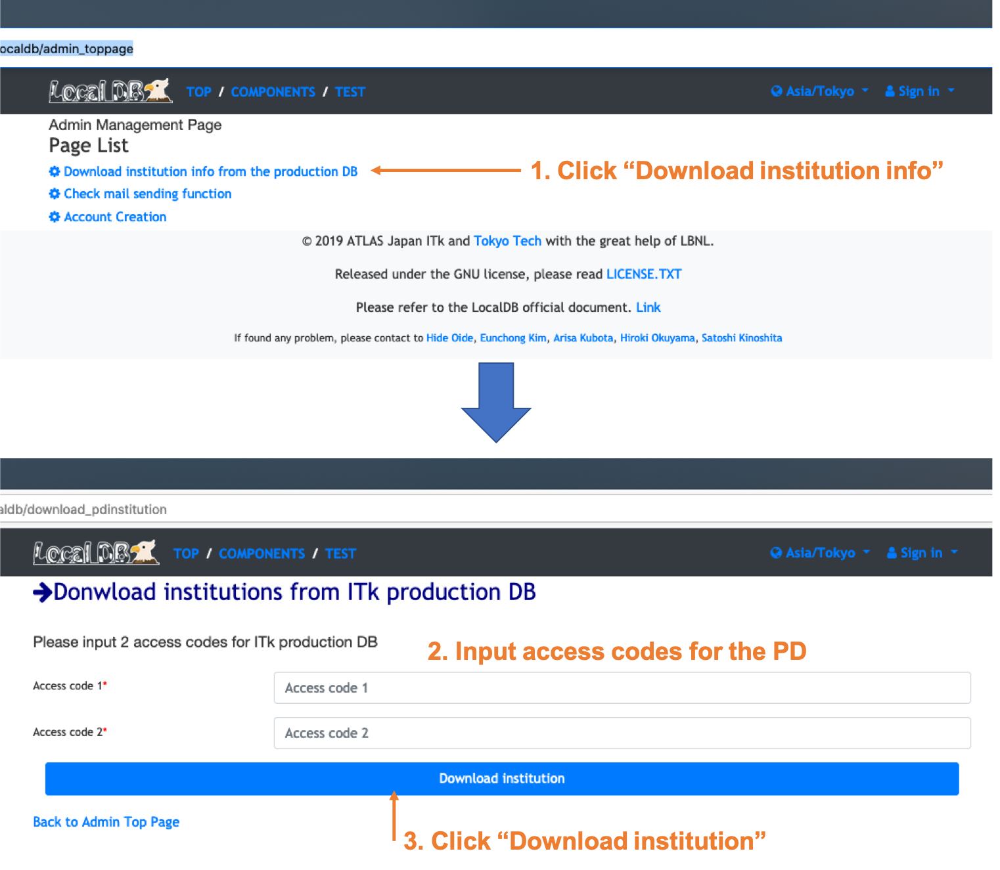

# Donwload institution lists from the ITk production DB
Need to download the institution lists from the production DB to manage the module QC site. 
If you don't have an account for the production DB. Please sign up following the link below. 
Tutorial page for ITk production DB[(https://gitlab.cern.ch/jpearkes/itkpd_tutorial/blob/master/README.md)](https://gitlab.cern.ch/jpearkes/itkpd_tutorial/blob/master/README.md) 

Please go to the admin page in LocalDB and follow the instruction below. 
 

 
[&rarr; Back to the page](setup_database.md)
