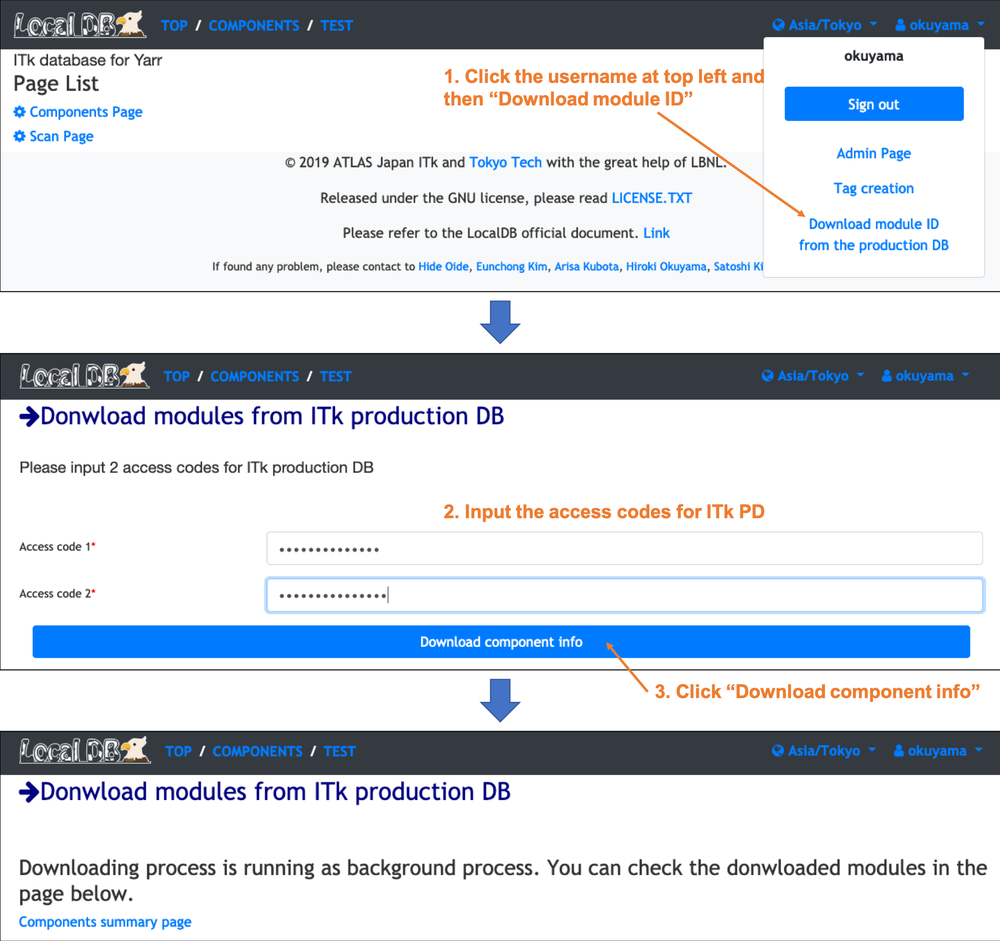

# Download modules from the production DB to LocalDB

Need to download module ids from the production DB to LocalDB to connect the QC results to a proper id in the DB. 
We can download the ids at once following the instruction below. 

 

You can check the downloaded module list in the page below. 
[http://127.0.0.1:5000/localdb/components](http://127.0.0.1:5000/localdb/components) or https://IPADRESS:5000/localdb/components. 

