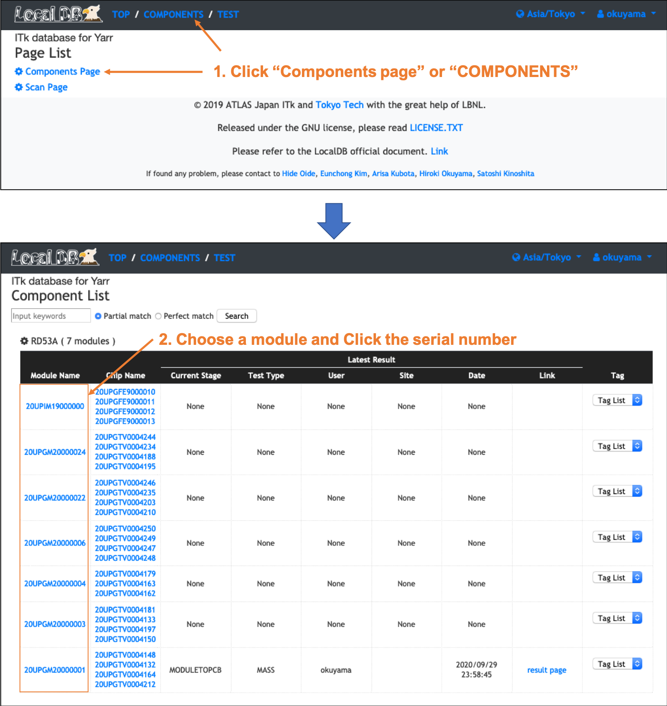
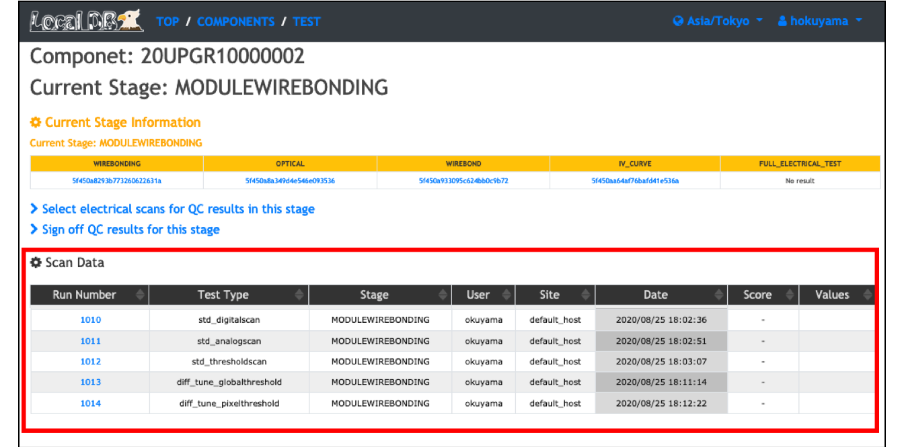

# Do electrical tests and upload the results to LocalDB

## I. SW Installation

Install related SW packages in your DAQ machine. 
Please follow the link below. 
[SW_Installation](sw_installation.md)

## II. Set and Run scans 
[Set_And_Run_Scans](set_and_run_scans.md)

## III. Monitor DCS in Grafana

Please refer to the following page used in the tutorial on February. 
[https://qc-demonstration.readthedocs.io/en/latest/database_demonstration_grafana/](https://qc-demonstration.readthedocs.io/en/latest/database_demonstration_grafana/) 

## IV. Check the results in LocalDB viewer
Open your browser and access the LocalDB viewer. 
The url is [http://127.0.0.1:5000/localdb](http://127.0.0.1:5000/localdb) or https://IPADRESS:5000/localdb.  

Go to the module's toppage following the instruction below. 
 

You can see the uploaded scan results in the table of "Scan Data" in the page as below. 
 

## V. Select scan results as QC results in LocalDB viewer
[Select_Scan_Result](select_scans.md)
