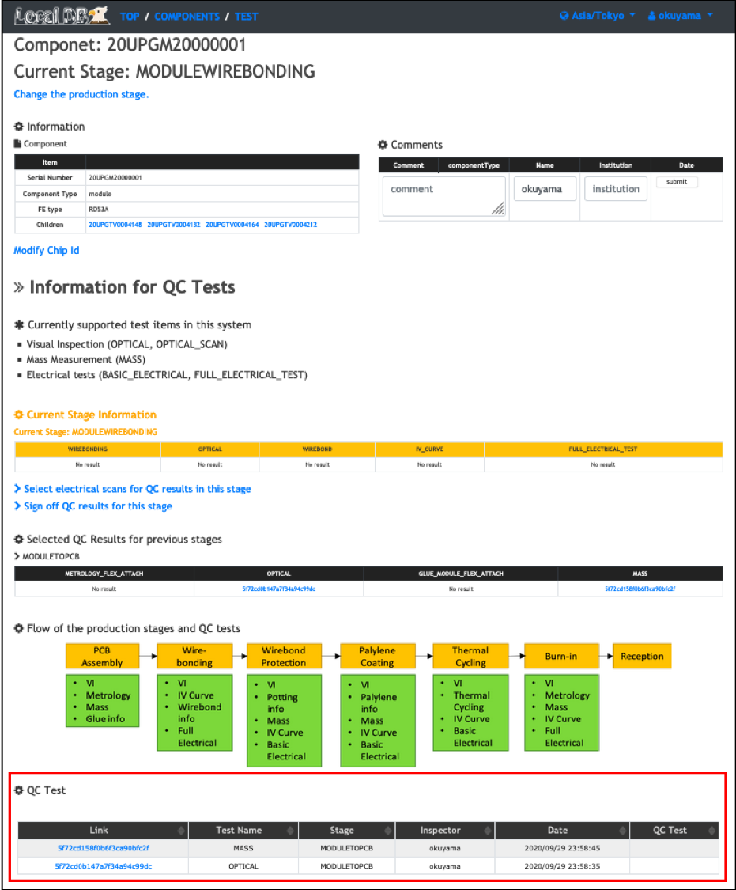

# Do non-electrical tests and upload the results to LocalDB

The GUI tool is prepared to upload QC test results to LocalDB.<br>
<br>
Please follow the link below.<br>
[QCHelper](https://gitlab.cern.ch/atlas-itk/sw/db/pixels/qc-viz-tools-dev/qc-helper/-/tree/master)
<br>
## I. Environment
Suported OS<br>
* Cent OS 7<br>
* macOS 10.15.3<br>

Required packages<br>
* Python3<br>
* PyQt5<br>
* OpenCV<br>
Setup<br>
```
pip3 install PyQt5
pip3 install opencv-python (for macOS)
pip3 install opencv-python==4.1.2.30 (for macOS)
```
## II. Installation
Install QCHelper in your machine.<br>
<br>
Install<br>
```
mkdir Workdir
cd ./Workdir
git clone -b [latest version] --recursive https://gitlab.cern.ch/atlas-itk/sw/db/pixels/qc-viz-tools-dev/qc-helper.git
```
## III. Start GUI
```
cd Workdir/qc-helper
python3 main.py
```
## IV. Operating procedure
Please follow "instruction.pdf" in the latest version of the [QCHelper](https://gitlab.cern.ch/atlas-itk/sw/db/pixels/qc-viz-tools-dev/qc-helper/-/tree/master)

## V. Check the uploading results in LocalDB viewer
Open your browser and access the LocalDB viewer.<br>
The url is [http://127.0.0.1:5000/localdb](http://127.0.0.1:5000/localdb) or https://IPADRESS:5000/localdb.<br><br>

Go to the module's toppage following the instruction below.<br>
<br>

You can see the uploading results in the table of "QC Test" in the page as below.<br>
<br>

