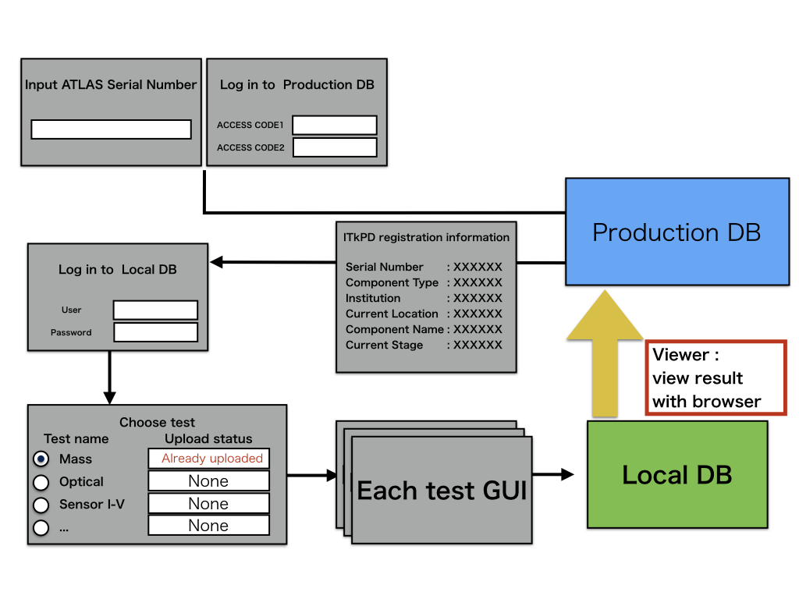

# Do non-electrical tests and upload the results to LocalDB

QCHelper is GUI tool to upload QC results to localDB.<br>
<br>

## I. Start GUI
```bash
cd Workdir/qc-helper
python3 main.py
```
## II. Operating procedure
Please follow "instruction.pdf" in the latest version of the [QCHelper](https://gitlab.cern.ch/atlas-itk/sw/db/pixels/qc-viz-tools-dev/qc-helper/-/tree/master)

## III. Check the uploading results in LocalDB viewer
Open your browser and access the LocalDB viewer.<br>
The url is [http://127.0.0.1:5000/localdb](http://127.0.0.1:5000/localdb) or https://IPADRESS:5000/localdb.<br><br>

Go to the module's toppage following the instruction below.<br>
<br>

You can see the uploaded results in the table of "QC Test" in the page as below.<br>
You can go to the result page for each test by clicking the ids in the table.<br>
<br>

<br>
[&rarr; Back to the page](module_QC_flow.md)
