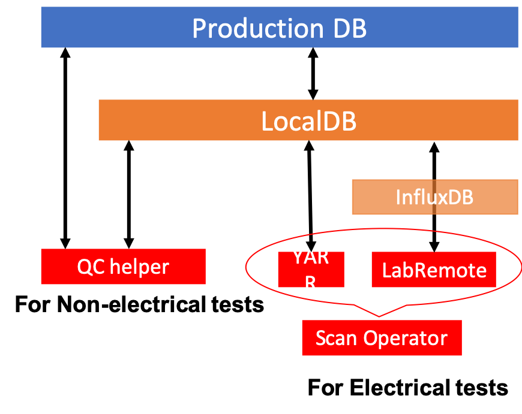
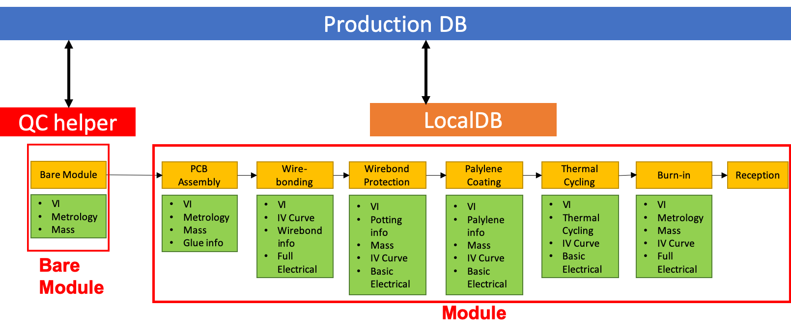

# RD53A Demonstration doc

This is a documentation about the SW packages for module QC. 
The doc describes how to use the packages folloing the flow of the module assembly and its QC. 

* `Production DB`: A central DB for ITk,setup in Czech. 
* `LocaalDB`: A local DB based on mongoDB to store module info, scan results and so on. 
* `InfluxDB`: A DB dedicated for time series data to store DCS data.  
* `QC helper`: A SW to register QC results to LocalDB, especially for Non-electrical tests. 
* `YARR`: A SW to use electrical tests and upload the results to LocalDB. 
* `LabRemote`: A SW to control DCS and upload the data to LocalDB via InfluxDB. 
* `Scan Operator`: A SW to use in electrical tests. It can help the user operation in the tests with YARR and LabRemote. 

In the flow of the module assembly, we recept a bare module and PCB. 
For bare module QC, we only use "QC helper". It helps QC test and analysis results. It also interfaces to the production DB. 
For module QC, we use LocalDB for data management system. We store QC results to the DB and upload/download the data
to sync the production DB. 

Please follow the QC steps from the link below. 

**Flow for Bare module QC** 
[bare_module_QC_flow](bare_module_QC_flow.md)

**Setup LocalDB in your DB server** 
[setup_database](setup_database.md)

**Flow for module(bare + flex) QC** 
[module_QC_flow](module_QC_flow.md)

## Git repositry and contact person for each SW package

## Reference
1. Document of "Traveling module"[(https://moduledaqdb.readthedocs.io/en/latest/)](https://moduledaqdb.readthedocs.io/en/latest/)
2. Yarr docs[(https://yarr.readthedocs.io/en/latest/)](https://yarr.readthedocs.io/en/latest/)
3. LocalDB docs[(https://localdb-docs.readthedocs.io/en/master/)](https://localdb-docs.readthedocs.io/en/master/)
4. Tutorial page for ITk production DB[(https://gitlab.cern.ch/jpearkes/itkpd_tutorial/blob/master/README.md)](https://gitlab.cern.ch/jpearkes/itkpd_tutorial/blob/master/README.md)
5. Documents for QC tutorial in February
6. Module QC documentation[(https://cds.cern.ch/record/2702738/files/ATL-COM-ITK-2019-045.pdf?)](https://cds.cern.ch/record/2702738/files/ATL-COM-ITK-2019-045.pdf?)
7. MongoDB web[(https://www.mongodb.com)](https://www.mongodb.com)
8. InfluxDB web[(https://www.influxdata.com)](https://www.influxdata.com)
9. Gragfana web[(https://grafana.com)](https://grafana.com)

