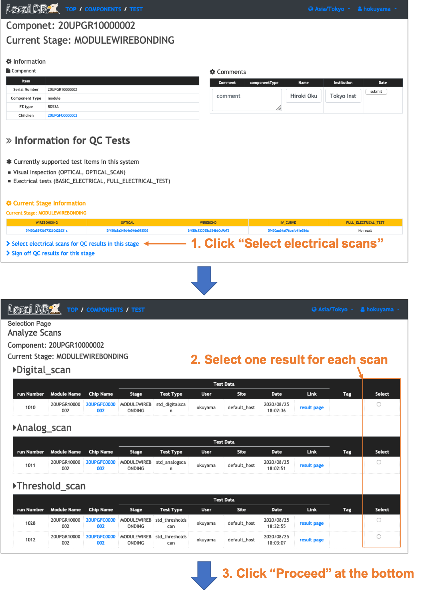
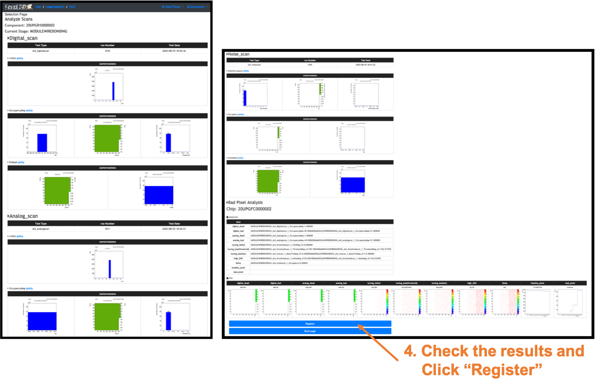
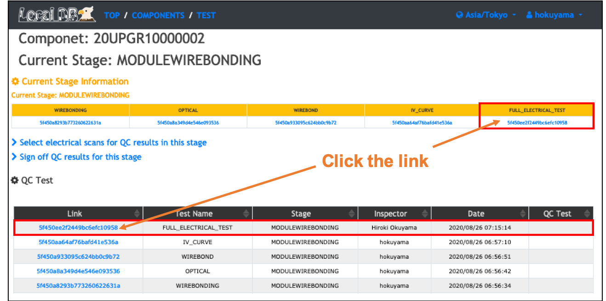

# Select scan results as QC results in LocalDB viewer
Need to select scans and register those as QC results for an electrical test of this stage.  

## (i) Select and Register scans for QC results of electrical tests for this stage
Please follow the instruction below after sign-in on your viewer to click "Sign-in" at the top left conner. 

 
 

## (ii) View the selected results in LocalDB viewer
You can check the selected scans as QC results for "BASIC_ELECTRICAL" or "FULL_ELECTRICAL_TEST" on the top page of the module in LocalDB viewer. 
 

 
[&rarr; Back to the page](electrical_test.md)
