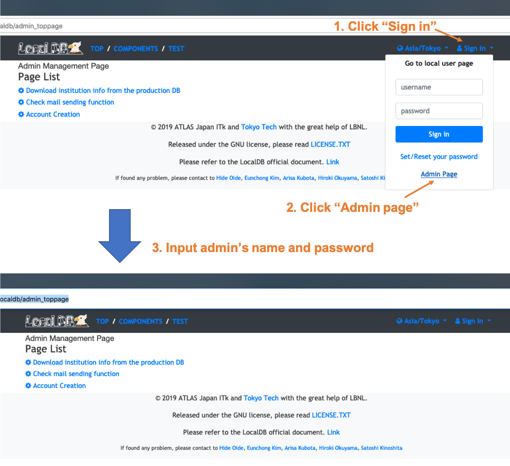

The following manual has to be executed by Admin in your site.
# Requirement OS
**CentOS7** is needed for this QC flow.<br>
Other requiements are described in the following page.<br>
[https://localdb-docs.readthedocs.io/en/1.4/installation/requirements-list/](https://localdb-docs.readthedocs.io/en/1.4/installation/requirements-list/)

# I. Installation
<span style="color: red; ">**Please skip this step if you have already installed LocalDB.**</span><br>
Clone localdb-tools in your working directory.<br>
```bash
$ cd <YOUR_WORK DIRECTRY>
$ git clone https://gitlab.cern.ch/YARR/localdb-tools.git
```

Refer to the following page.**YARR installation is not required if the machine is not for DAQ.**<br>
[https://localdb-docs.readthedocs.io/en/1.4/installation/manual-centos/](https://localdb-docs.readthedocs.io/en/1.4/installation/manual-centos/)

#II. Setting for mongo DB

##1. Create an account in mongoDB as admin<br>
Refer to the following page.<br>
[https://localdb-docs.readthedocs.io/en/devel-localdb/script/create_admin/](https://localdb-docs.readthedocs.io/en/devel-localdb/script/create_admin/)
**In case you already have an account in LocalDB...**<br>
Please execute this script for the same name and password as admin to up to supprt the latest system.<br>
You need to unlock mongoDB before executing the script. Refer to the next step.<br>

##2. Lock mongoDB
Lock the mongoDB so that only those who know the account name and password can read and write to it.<br>
Follow the commands below:


Stop MongoDB instance:

```bash
$ sudo systemctl stop mongod.service
```

Enable or uncomment out security.authorization in /etc/mongod.conf:

```yml
...
security:
    authorization: enabled
...
```

Start MongoDB instance:

```bash
$ sudo systemctl start mongod.service
```

#III. Launch LocalDB viewer
Create config file to setup viewer and Start LocalDB viewer following the page below:<br>
[https://localdb-docs.readthedocs.io/en/devel-localdb/script/setup-viewer/](https://localdb-docs.readthedocs.io/en/devel-localdb/script/setup-viewer/)
<br>
<span style="color: red; ">**We can see the viewer while the process is running.**</span><br>


#IV. Setting for LocalDB
Please open your browser and access the LocalDB viewer.<br>
The url is [http://127.0.0.1:5000/localdb](http://127.0.0.1:5000/localdb) or https://IPADRESS:5000/localdb.<br><br>

Go to the admin page with admin's username and password.<br>

Please do the folloing setting.<br>

## 1. Check the mail function

## 2. Download institution info from the production DB

## 3. Register QC user in LocalDB viewer 
